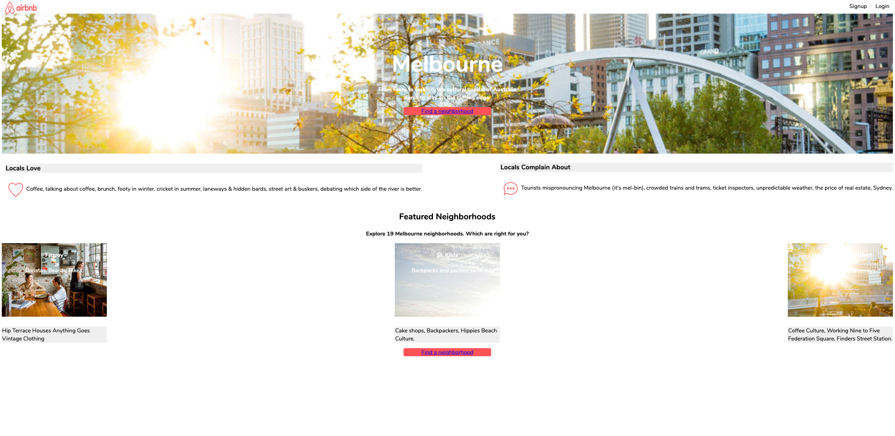

# Homework 2 Feedback

Hi Christina. Here's your feedback.

In particular, you asked:

- The logo looks a little squished at the top left
   - The problem is that you have set both the width and the height.
     In general for images, avoid doing this. Set the most important one in your context (in this  case it might be the height to match the height of the header) and then set the other to `auto`, for example:

     ```css
     .logo {
       width: auto;
       height: 33px;
       padding-left: 10px;
     }
     ```

   - You may also want to note that the `padding-left` forms part of the `width`,
     so if you had a 100x33 image and you gave it `width: 100px` and `height: 33px` but `padding-left: 25px`, it would be squashed, because only 75 pixels available for the width of the image to squeeze into.

- How do I add the color in the section behind 'Locals Love' and 'Locals Complain about'?
  - When you have a block of colour in a webpage, it is the `background-color` of some element.
  - In this case, you have your `.container1` element.
  - You'll also want the two blocks in front (`.div1` and `.div2`) to have a `white` background.
- How to align the icons (heart, chat) and text to the middle?
  - `display: flex` is your friend here, remember that it gives us the ability to align items in the cross-axis with the `align-items` property
- In _Featured Neighborhoods_, why is the third box skewed?
  - I don't see what you mean here, sorry.
- Also, how come the "find a neighborhood' button looks different? I tried to add the white text, but had trouble.
  - By default, `<a>` elements get some familiar styling: `color: blue` and `text-decoration: underline`. This is default browser behaviour from the very first webpage.
  - If you want to change this styling, you have to set it on the `a` element itself,
    because it won't inherit `color` like other text does.
    For example, you can use a CSS block like this:
    ```css
    .button a {
        color: white;
        text-decoration: none;
    }
    ```

## HTML Structure and semantics

Great work on the top level of your HTML structure.
In particular, having your `<body>` like below makes it very easy for other developers (as well as browsers and screenreaders) to understand the structure.

```html
  <body>
    <header>
     …
    </header>

    <section class="container">
      …
    </section>

    <section>
    …
    </section>

    <section>
     …
    </section>
  </body>
```

The `<header>` is similarly well-structured.

Beyond that, there's major room for improvement for having readable, well-named HTML.

### Better naming

```html
<div class="container1">
    <div class="div1">
        …
    </div>
    <div class="div2">
        …
    </div>
</div>
```

See here, `div1` and `div2` are really poor class names.
Viewed in isolation here, there's no information about what's inside these.
It's so generic that it doesn't describe your content at all.

If I were to change this to

```html
<div class="locals-information">
    <div class="locals-like">
        …
    </div>
    <div class="locals-dislike">
        …
    </div>
</div>
```

then they're descriptive now.
Without even looking inside them, you'd have a good idea which content they're wrapping.

As a consequence, your CSS would also go from being hard to understand to being more descriptive.

<table>
  <thead>
    <tr>
      <th>Before</th>
      <th>After</th>
    </tr>
  </thead>
  <tbody>
    <tr>
      <td>

```css
.div1 {
   …
}

.localslove {
   …
}

.container1 {
    …
}
```

</td>
<td>

```css
.locals-like {
  …
}

.localslove {
  …
}

.locals-information {
  …
}
```

</td>
    </tr>
  </tbody>
</table>


## Large screens

On large screens, your site has a lot of empty space.



Try setting some sensible `max-width` properties on your containers,
or alternatively,
use `justify-content: center;` with some sensible `column-gap` values to create the space
between elements.