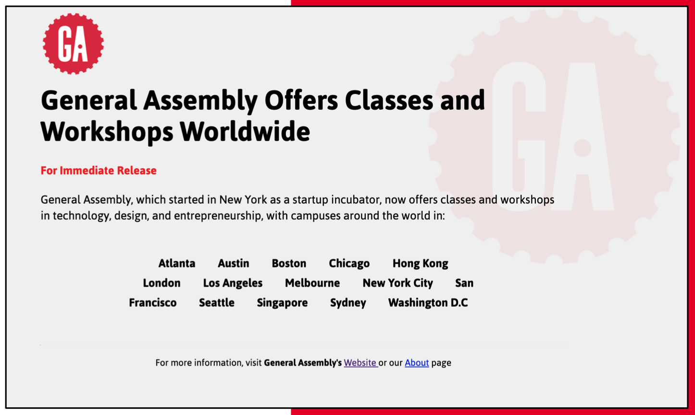

# Homework Assignment

Our goals in this homework are to:

- Reinforce basic HTML / CSS skills
- Use browser developer tools
- Expand your HTML and CSS horizons with new tags and properties

## Objective: Make a GA Press Release

The assignment is to make a **press release for General Assembly**,
like the one pictured below.

All the content and colours you need are listed in `index.html`.

To start, make a copy of this starter folder in your own solution folder at
`homework/basics/solution/<your-name>`.
Please use `lowercase-kebab-case` for folder and file names!

For inspiration, take a look at the existing solutions, for example
[Robin's solution at `../solution/robin/index.html`](../solution/robin/index.html).

## Use your browser's developer tools

Use the **element inspector** as you're building.
It's a great way to test CSS changes quickly, select colours,
and understand how your rules cascade.

The following videos give an overview of developer tools for Firefox and Chrome

- [Inspecting CSS Cascade rules in Firefox](https://www.youtube.com/watch?v=Sp9ZfSvpf7A)
- [Chrome's developer tools for beginners](https://www.youtube.com/watch?v=wcFnnxfA70g)

Read the following articles to learn how to manipulate a page in your browser

- [Examine and edit CSS on Firefox](https://developer.mozilla.org/en-US/docs/Tools/Page_Inspector/How_to/Examine_and_edit_CSS)
- [Examine and edit CSS on Chrome](https://developers.google.com/web/tools/chrome-devtools/inspect-styles/)

For more on what tools Firefox Developer Edition has which aren't available in Chrome,
see [14 Firefox Developer Tools You Might Not Know About](https://www.youtube.com/watch?v=S36N8RGdY2U).

### More solution examples

All of these were made by students just like you!

- Solution 1: https://codepen.io/GAmarketing/pen/yLyLjwq
- Solution 2: https://codepen.io/GAmarketing/pen/eYmYrob
- Solution 3: https://codepen.io/GAmarketing/pen/yLyLqGg
- Solution 4: https://codepen.io/GAmarketing/pen/mdydjaY
- Solution 5: https://codepen.io/GAmarketing/pen/eYmYjxE
- Solution 6! https://codepen.io/GAmarketing/pen/qBEdoGV