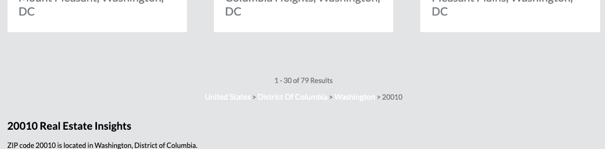
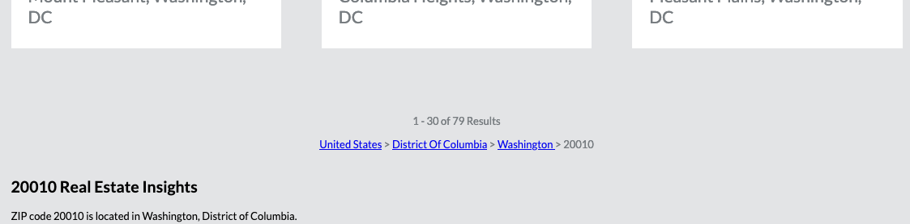

# Homework 3 Feedback

Great work, Sipo. This site is looking good, very close to the design. On larger screens (like mine), there's a lot of unused space,
but on smaller desktops and mobiles it looks great.

## Flex fallback

I'm impressed that you have `display: flex;` for the `.wrapper` in case `display: grid;` is not supported.
I looked at how the site looks in this case, and it's still quite good, although there are 5 columns in this case.
Try to use `flex-basis` to make the flex version more closely match the three-column grid version of the site.

## Grid

Your grid is great, and the use of `auto-fill` to determine the number of columns is neat.

Following our responsive design lessons, you may want to use `@media` queries to specify the number of columns
on different device sizes. For instance, you could default to `grid-template-columns: repeat(1, 1fr);` and overriding
with `grid-template-columns: repeat(2, 1fr);` and `grid-template-columns: repeat(3, 1fr);` on larger screen sizes.

### Grid First Row

I've added `grid-template-rows: auto;` so that the first row of your grid doesn't take the `minmax(250px, auto)` height setting from `grid-auto-rows`.
Take a look at how this lets the header row be shorter than the `250px` minimum.

## Breadcrumbs



Notice how your breadcrumb links are taking the `color: #fff;` setting from your `styleee.css` stylesheet.

It's a good practice to use specific CSS selectors for your `a` colour overrides for things like headers with unique background colours.

Instead of

```css
a:link {
  color: #fff;
  font-size: 0.9rem;
  text-decoration: none;
}
```

you could be specific and set

```css
.header a:link {
  color: #fff;
  font-size: 0.9rem;
  text-decoration: none;
}
```

In this case, the other links will fallback to the browser default style. You can always override them with a specific block if you need to, but at least now they're more visible than when they were white text on a grey background.



## `.header` and `.footer`

As you know, since HTML5, we have new `<header>` and `<footer>` tags.
These are preferred because they are semantic.
Screenreaders, browsers, bots, and your fellow developers can easily find and understand the purpose of a `<header>` and `<footer>` tag.

There's no need to add `.header` and `.footer` classes to your headers and footers.
You can just select them by tag name.

If you have a complicated page structure with many headers,
then you may want to introduce classes to select them.
Even then, however, you may have other structural ways of selecting them.

For instance, it's a standard practice for `<section>` elements to have a `<header>` element when applicable.
In such a case, `main header { … }` or `body > header { … }` could select your main header,
and `section header { … }` could select the others.

## CSS Structure

I like that you've broken your CSS into different files.

I like that within those CSS files, you've got comments for section breaks like

```css
/*============footer===========*/
```

This is really great to see.
Both of these structural choices make your CSS easier to understand and to maintain.
Any front-end web developers on a team with you will appreciate decisions like this.
Keep up the good work!
