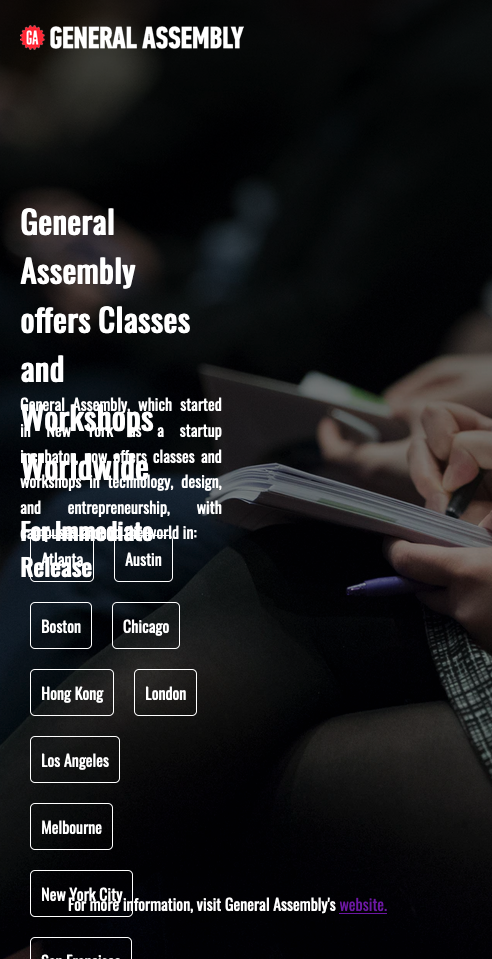

# Homework Feedback

Great work here. I really like how it looks,
it might be the best design I've seen for one of these pages.

I also really like that you made all the cities into links
to the corresponding landing pages. You may want to go one step
further and make a visual difference on hover,
by using [the `:hover` pseudo-class](https://developer.mozilla.org/en-US/docs/Web/CSS/:hover).

Your HTML and CSS are very clean and easy to read.
I only noticed two errors in your CSS, both of which I've commented in the file.

## Background

The background of the page is excellent.
I like the choice of image, but especially I like the
linear gradient over the top, and your use of

```css
background-position: center;
background-repeat: no repeat;
background-size: cover;
```

is advanced too. The only correction is that `no repeat` should be `no-repeat` instead.

## Comments

It's interesting for me to see the commented out code in CSS and HTML because it reveals
things you attempted and later removed.

Some developers comment out bits of code that they're no longer using
because they think they may want to use them later.
One of the advantages of version control software like Git
is that it allows us to see previous versions of our code,
so long as we made a commit of that previous version.

In practice, and in real life, it's neater to remove code that isn't being used.

## Position

It's nice to see you're working with `position: relative;` and `position: absolute;` here. However, it makes your design quite brittle, for instance on a small screen or small browser window, the content overlaps.



This can be avoided with some of the layout practices we'll learn in Week 2 and Week 3.
We'll cover positioning more later in the course.
It would be good to see you revisit this homework
later in the course to solve this overlap problem.
Let me know if you do try that.

## Class Names

One area where there's room for improvement is on your class names.
On the one hand, `locations` is a great class name, although you haven't
used it to set any styling in your CSS, but the name is nonetheless
a good one because it describes us the purpose of that list.

On the other hand, `p1` and `p2` are much less descriptive.
I can tell that these mean the first and second paragraphs,
but something more meaningful like `history` for the first paragraph
and `call-to-action` (or `more-info`) for the second add extra information for
other developers to understand the purpose.

Imagine you reordered the paragraphs. `p1` and `p2` wouldn't keep their meaning,
but `history` and `call-to-action` would.
