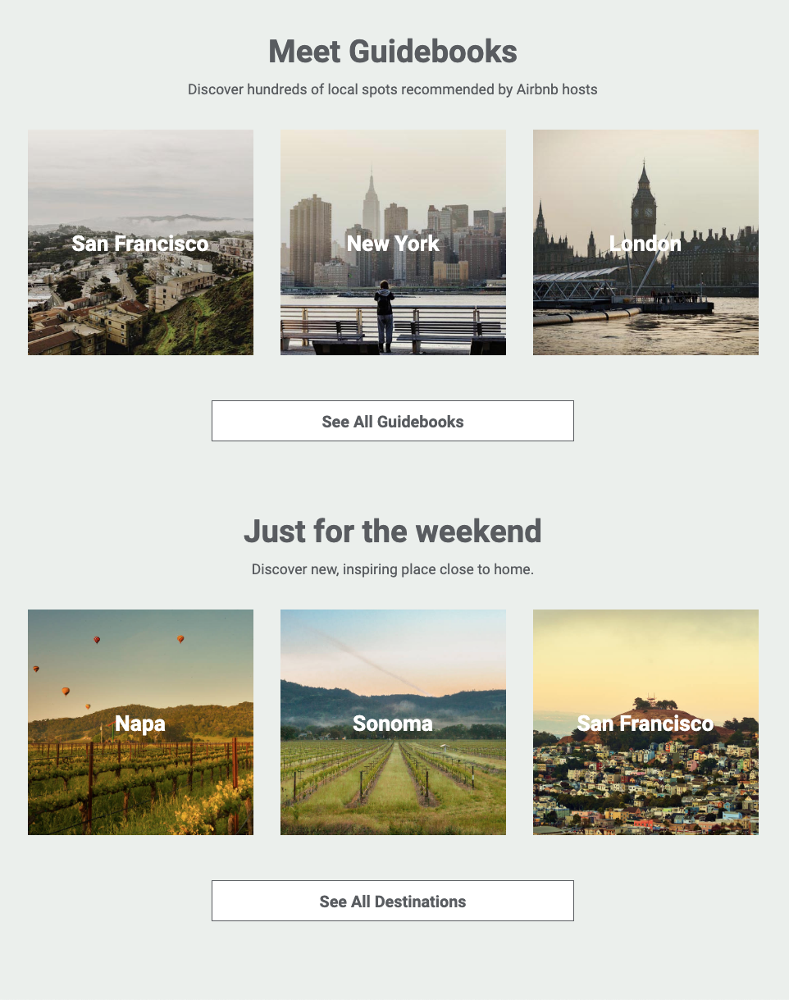

# Flexbox Homework Assignment

In this week's homework, you'll be flexing your **flexbox** muscles.

Our goals in this homework are to:

- Build HTML and CSS layouts with Flexbox
- Strategize a layout by making a wireframe
- Start a project from scratch
- Practice building a website in VSCode

## Instructions

Recreate the following part of the Airbnb website.

Your aim is to recreate exactly this screenshot.
All images are provided in the `./images` folder inside this starter pack.

The colours and fonts you need are as follows:

- **Google Font**: `Roboto`
- **Text colour**: `rgb(89,92,96)`
- **Background colour**: `#ebefec`

### Steps

If you want some pointers on where to start, you can follow these steps.

1. Start by adding the page structure. Do you remember the shortcut?
2. Draw yourself a wireframe to get familiar with the layout.
2. Translate your wireframe into your html structure.
3. Link your css file. Double check it's linked correctly!
4. Then start styling!

Try to work on the big-picture layout first, then move on to the details.

For an extra challenge, add some additional content and add css in the Airbnb style.

### Tips!

Start by drawing out a wireframe for the site based on the layout picture you've been given.
Consider which sections might be grouped inside a container element,
such as a semantic `<section>` or non-semantic `
` tag.

## Solutions

To start your solution, copy the images from this starter folder into your own solution folder at
`homework/flexbox/solution/<your-name>`.
Please use `lowercase-kebab-case` for folder and file names!

For example, if your name was _Bob Dylan_, your folder would be
`homework/flexbox/solution/bob` or if there's too many Bobs,
`homework/flexbox/solution/bob-dylan`. (Congratulations on the Nobel, Bob.)

As always, there are example solutions in the solution folder.
For inspiration, take a look at these existing solutions, for example
[Robin's solution at `../solution/robin/index.html`](../solution/robin/index.html).

You can also see an example on codepen at https://codepen.io/GAmarketing/pen/Yzzjgqb.

## Use your browser's developer tools

Use the **element inspector** as you're building.
It's a great way to test CSS changes quickly, select colours,
and understand how your rules cascade.

The following videos give an overview of developer tools for Firefox and Chrome

- [Inspecting CSS Cascade rules in Firefox](https://www.youtube.com/watch?v=Sp9ZfSvpf7A)
- [Chrome's developer tools for beginners](https://www.youtube.com/watch?v=wcFnnxfA70g)

Read the following articles to learn how to manipulate a page in your browser

- [Examine and edit CSS on Firefox](https://developer.mozilla.org/en-US/docs/Tools/Page_Inspector/How_to/Examine_and_edit_CSS)
- [Examine and edit CSS on Chrome](https://developers.google.com/web/tools/chrome-devtools/inspect-styles/)

For more on what tools Firefox Developer Edition has which aren't available in Chrome,
see [14 Firefox Developer Tools You Might Not Know About](https://www.youtube.com/watch?v=S36N8RGdY2U).
